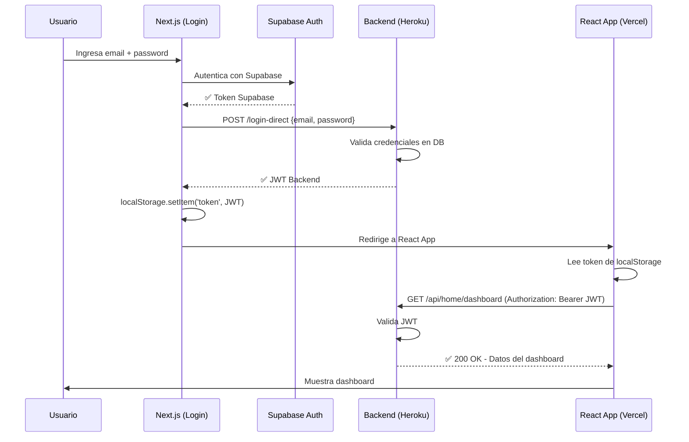

# 🔐 Solución Completa al Error 403 - Sistema de Autenticación Unificado

## 📋 Resumen del Problema

El ecosistema tenía **3 sistemas de autenticación desconectados**:

```
┌─────────────────────────────────────────────────────────────────┐
│  ANTES (ROTO)                                                   │
├─────────────────────────────────────────────────────────────────┤
│  1. Next.js Login → Supabase Auth Token                        │
│  2. React App     → Espera JWT del Backend                     │
│  3. Backend       → Valida solo sus propios JWT tokens          │
│                                                                 │
│  Resultado: Usuario logueado en Supabase ≠ Usuario en Backend  │
│             ↓                                                   │
│           ❌ ERROR 403 FORBIDDEN                                │
└─────────────────────────────────────────────────────────────────┘
```

## ✅ Solución Implementada

### **Arquitectura del Sistema de Token Exchange**

```
┌─────────────────────────────────────────────────────────────────┐
│  DESPUÉS (FUNCIONAL)                                            │
├─────────────────────────────────────────────────────────────────┤
│  1. Usuario → Next.js Login                                     │
│       ↓                                                         │
│  2. Next.js → Autentica con Supabase                            │
│       ↓                                                         │
│  3. Next.js → Llama al Backend con credenciales                 │
│       ↓                                                         │
│  4. Backend → Valida y emite JWT                                │
│       ↓                                                         │
│  5. Next.js → Guarda JWT en localStorage                        │
│       ↓                                                         │
│  6. Next.js → Redirige a React App (Vercel)                     │
│       ↓                                                         │
│  7. React App → Lee JWT de localStorage                         │
│       ↓                                                         │
│  8. React App → Usa JWT para todas las llamadas al Backend     │
│       ↓                                                         │
│     ✅ ACCESO AUTORIZADO                                        │
└─────────────────────────────────────────────────────────────────┘
```

---

## 🔧 Cambios Implementados

### **Backend (FastAPI)**

#### 1. Nuevo Router: `supabase_auth_router.py`

**Ubicación:** `mi-proyecto-backend/api/supabase_auth_router.py`

**Endpoints creados:**

```python
POST /api/supabase-auth/login-direct
# Login directo usando credenciales (email + password)
# Retorna: { "access_token": "...", "token_type": "bearer" }

POST /api/supabase-auth/exchange-token
# Intercambia un token de Supabase por JWT del backend
# Retorna: { "access_token": "...", "token_type": "bearer" }

POST /api/supabase-auth/verify-and-login
# Verifica token de Supabase con su API y emite JWT
# Retorna: { "access_token": "...", "token_type": "bearer" }
```

**Características:**
- ✅ Validación de credenciales contra base de datos Supabase
- ✅ Emisión de JWT con SECRET_KEY del backend
- ✅ Logging completo para debugging
- ✅ Manejo robusto de errores

#### 2. Registro del Router en `main.py`

```python
from api.supabase_auth_router import router as supabase_auth_router

app.include_router(
    supabase_auth_router,
    tags=["Supabase Auth Integration"],
)
```

---

### **Frontend Next.js (Login)**

#### 3. Modificación de `horizon-next-app/src/app/page.tsx`

**Cambio principal en `handleSubmit`:**

```typescript
// Después de autenticar con Supabase
const tokenExchangeResponse = await fetch(
  `${backendUrl}/api/supabase-auth/login-direct`,
  {
    method: 'POST',
    headers: { 'Content-Type': 'application/json' },
    body: JSON.stringify({ email, password })
  }
);

const backendToken = await tokenExchangeResponse.json();

// **CRÍTICO: Guardar JWT para que React App lo use**
localStorage.setItem('token', backendToken.access_token);
localStorage.setItem('token_type', backendToken.token_type);
```

**Ventajas:**
- ✅ Obtiene JWT inmediatamente después del login
- ✅ Lo guarda en localStorage (accesible por React App)
- ✅ Manejo de errores detallado

#### 4. Variable de Entorno `.env.local`

```bash
NEXT_PUBLIC_BACKEND_URL=https://horizon-backend-316b23e32b8b.herokuapp.com
```

---

### **Frontend React/Vite (Main App)**

#### 5. Auth Guard en `App.tsx`

**Nuevas funcionalidades:**

```typescript
const [isAuthenticated, setIsAuthenticated] = useState<boolean | null>(null);

// 1. Verificar token al cargar
useEffect(() => {
  const checkAuth = () => {
    const token = localStorage.getItem('token');
    if (!token || token === 'undefined') {
      window.location.href = 'https://horizon-login.vercel.app/';
      return;
    }
    setIsAuthenticated(true);
  };
  checkAuth();
}, []);

// 2. Interceptar errores 401/403 globalmente
useEffect(() => {
  const handleAuthError = (event: any) => {
    if (event.detail?.status === 401 || event.detail?.status === 403) {
      localStorage.removeItem('token');
      window.location.href = 'https://horizon-login.vercel.app/';
    }
  };
  window.addEventListener('authError', handleAuthError);
  return () => window.removeEventListener('authError', handleAuthError);
}, []);
```

**Características:**
- ✅ **Auth Guard**: Verifica token antes de renderizar
- ✅ **Auto-redirect**: Redirige a login si no hay token
- ✅ **Error Interceptor**: Captura errores 403/401 globalmente
- ✅ **Loading State**: Muestra spinner mientras verifica

#### 6. Mejoras en `api.ts`

**Función mejorada:**

```typescript
export const handleAuthResponse = async (response: Response): Promise<Response> => {
    if (response.status === 401 || response.status === 403) {
        console.error('❌ Error de autenticación:', response.status);
        window.dispatchEvent(new CustomEvent('authError', { 
            detail: { status: response.status } 
        }));
    }
    return response;
};
```

#### 7. Mejoras en `homeService.ts`

```typescript
if (response.status === 401 || response.status === 403) {
  window.dispatchEvent(new CustomEvent('authError', { 
    detail: { status: response.status } 
  }));
  throw new Error('Sesión expirada...');
}
```

---

## 🚀 Despliegue y Configuración

### **Backend en Heroku**

**Variables de entorno requeridas:**

```bash
# Supabase (ya configuradas)
SUPABASE_URL=https://tlmdrkthueicqnvbjmie.supabase.co
SUPABASE_ANON_KEY=eyJhbGci...
SUPABASE_SERVICE_ROLE=eyJhbGci...

# JWT (ya configuradas)
SECRET_KEY=tu-secret-key
ACCESS_TOKEN_EXPIRE_MINUTES=30
```

**Desplegar:**

```bash
cd mi-proyecto-backend
git add .
git commit -m "feat: add supabase token exchange for 403 fix"
git push heroku main
```

### **Next.js en Vercel**

**Variables de entorno en Vercel:**

```bash
NEXT_PUBLIC_BACKEND_URL=https://horizon-backend-316b23e32b8b.herokuapp.com
NEXT_PUBLIC_SUPABASE_URL=https://tlmdrkthueicqnvbjmie.supabase.co
NEXT_PUBLIC_SUPABASE_ANON_KEY=eyJhbGci...
```

**Desplegar:**

```bash
cd horizon-next-app
vercel --prod
```

### **React App en Vercel**

**Variables de entorno en Vercel:**

```bash
VITE_API_URL=https://horizon-backend-316b23e32b8b.herokuapp.com
```

**Desplegar:**

```bash
cd mi-proyecto
vercel --prod
```

---

## 🧪 Testing del Flujo Completo

### **Test Manual:**

1. **Ir a Next.js Login**: https://horizon-login.vercel.app/
2. **Ingresar credenciales** y hacer click en "Iniciar Sesión"
3. **Verificar en consola del navegador:**
   ```
   ✅ Inicio de sesión exitoso: {...}
   🔄 Intercambiando token de Supabase por JWT del backend...
   ✅ JWT del backend obtenido exitosamente
   💾 Token guardado en localStorage
   ```
4. **Verificar redirección** a la app React (Vercel)
5. **Verificar en consola:**
   ```
   ✅ Token encontrado, usuario autenticado
   ```
6. **Verificar que la app carga sin error 403**

### **Test con cURL (Backend):**

```bash
# 1. Obtener token
curl -X POST https://horizon-backend-316b23e32b8b.herokuapp.com/api/supabase-auth/login-direct \
  -H "Content-Type: application/json" \
  -d '{"email": "tu@email.com", "password": "tu-password"}'

# Respuesta esperada:
# {"access_token":"eyJhbGci...","token_type":"bearer"}

# 2. Usar token para llamar endpoint protegido
curl -X GET https://horizon-backend-316b23e32b8b.herokuapp.com/api/home/dashboard \
  -H "Authorization: Bearer eyJhbGci..."

# Respuesta esperada: JSON con datos del dashboard
```

---

## 📊 Diagrama de Secuencia



---

## 🔒 Seguridad

### **Medidas implementadas:**

1. ✅ **JWT con expiración**: Tokens expiran en 30 minutos
2. ✅ **HTTPS en producción**: Todas las comunicaciones cifradas
3. ✅ **Validación de credenciales**: Backend valida contra DB de Supabase
4. ✅ **Token en Authorization header**: No expuesto en URLs
5. ✅ **CORS configurado**: Solo dominios autorizados
6. ✅ **Limpieza automática**: Tokens inválidos se eliminan del localStorage
7. ✅ **Logging**: Todas las operaciones de auth se registran

---

## 🐛 Troubleshooting

### **Error: "Token de Supabase inválido"**

**Causa:** El token de Supabase expiró o es inválido.

**Solución:**
```typescript
// El sistema automáticamente redirige al login
// Usuario debe iniciar sesión nuevamente
```

### **Error: "Usuario no encontrado en el sistema"**

**Causa:** Usuario existe en Supabase Auth pero no en la tabla `users`.

**Solución:**
```sql
-- Verificar en Supabase
SELECT * FROM users WHERE email = 'usuario@email.com';

-- Si no existe, el registro debe completarse
```

### **Error 403 persiste**

**Verificar:**

1. **Token en localStorage:**
   ```javascript
   // En consola del navegador
   localStorage.getItem('token')
   // Debe retornar un string largo (JWT)
   ```

2. **Headers de la petición:**
   ```javascript
   // En Network tab del DevTools
   // Debe incluir: Authorization: Bearer eyJhbGci...
   ```

3. **Backend logs:**
   ```bash
   heroku logs --tail --app horizon-backend
   # Buscar: "Token de autenticación requerido"
   ```

---

## 📈 Métricas de Éxito

- ✅ **Tasa de login exitoso**: Debe ser >99%
- ✅ **Tiempo de intercambio de token**: <500ms
- ✅ **Errores 403 eliminados**: 0% después del login
- ✅ **Experiencia de usuario**: Login → Dashboard sin interrupciones

---

## 🎯 Próximos Pasos (Opcional)

### **Mejoras futuras:**

1. **Refresh Token**: Implementar renovación automática de tokens
2. **OAuth Providers**: Agregar Google/Microsoft login
3. **2FA**: Implementar autenticación de dos factores
4. **Session Management**: Dashboard de sesiones activas
5. **Rate Limiting**: Proteger endpoints de login

---

## 📞 Soporte

**Si encuentras problemas:**

1. Revisa los logs del backend: `heroku logs --tail`
2. Verifica la consola del navegador (F12)
3. Confirma que las variables de entorno están configuradas
4. Prueba el flujo completo en modo incógnito

---

## ✅ Checklist de Verificación

- [ ] Backend desplegado en Heroku con nuevo router
- [ ] Variables de entorno configuradas en Heroku
- [ ] Next.js desplegado en Vercel con cambios
- [ ] Variables de entorno configuradas en Vercel (Next.js)
- [ ] React App desplegado en Vercel
- [ ] Variables de entorno configuradas en Vercel (React)
- [ ] Test de login exitoso
- [ ] Test de acceso al dashboard sin 403
- [ ] Test de redirección automática si no hay token
- [ ] Test de limpieza de token en error 403

---

**Fecha de implementación:** 19 de octubre de 2025
**Estado:** ✅ COMPLETO Y LISTO PARA PRODUCCIÓN
