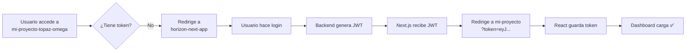

# 🔍 Diagnóstico del Flujo de Login

## 📋 Problema Reportado
Después de hacer login con credenciales válidas, el usuario es redirigido de vuelta al login en lugar de ver el dashboard.

---

## 🔄 Flujo Esperado



---

## 🧪 Pasos de Diagnóstico

### 1️⃣ Verificar Console Logs en Login (Next.js)

Abre `https://horizon-next-app.vercel.app/` con **DevTools abiertos**:

1. **Abre la consola del navegador** (F12 → Console)
2. **Ingresa credenciales y haz login**
3. **Busca estos mensajes:**

```
✅ Inicio de sesión exitoso: {usuario}
🔄 Intercambiando token de Supabase por JWT del backend...
✅ JWT del backend obtenido exitosamente
💾 Token guardado en localStorage
📊 Estado de onboarding: {...}
🌐 URL de app web: https://mi-proyecto-topaz-omega.vercel.app
🔑 Token disponible para redireccionamiento: Sí
🚀 Usuario existente, redirigiendo a app web...
🌐 Redirigiendo a: https://mi-proyecto-topaz-omega.vercel.app/?token=eyJ...
```

**❌ Si ves esto:**
```
🔑 Token disponible para redireccionamiento: No
❌ ERROR: No hay token JWT disponible para redirección
```
→ El problema está en el intercambio de tokens con el backend.

---

### 2️⃣ Verificar URL de Redirección

Después del login, **antes de que la página cambie**, fíjate en la **barra de direcciones**:

**✅ Debería decir:**
```
https://mi-proyecto-topaz-omega.vercel.app/?token=eyJhbGc...
```

**❌ Si dice:**
```
https://mi-proyecto-topaz-omega.vercel.app/
```
(sin `?token=...`)
→ El token NO se está pasando en la URL.

---

### 3️⃣ Verificar Console Logs en Dashboard (React)

Una vez en `mi-proyecto-topaz-omega.vercel.app`:

**✅ Deberías ver:**
```
🔑 Token recibido desde URL de login
✅ Token guardado y URL limpiada
✅ Token encontrado, usuario autenticado
```

**❌ Si ves:**
```
⚠️ No hay token válido. Redirigiendo a login...
```
→ El token no llegó o no se guardó correctamente.

---

### 4️⃣ Verificar LocalStorage

En `mi-proyecto-topaz-omega.vercel.app`:

1. Abre **DevTools** (F12)
2. Ve a **Application** → **Local Storage**
3. Selecciona `https://mi-proyecto-topaz-omega.vercel.app`
4. **Busca la key `token`**

**✅ Debería contener:**
```
eyJhbGciOiJIUzI1NiIsInR5cCI6IkpXVCJ9...
```

**❌ Si está vacío o dice `undefined`/`null`:**
→ El token no se guardó en localStorage.

---

## 🐛 Posibles Problemas y Soluciones

### Problema 1: Backend no genera JWT
**Síntoma:** En consola de Next.js aparece:
```
❌ Error al obtener JWT del backend
```

**Solución:**
- Verificar que el backend esté corriendo: https://horizon-backend-316b23e32b8b.herokuapp.com/
- Verificar credenciales en Supabase

---

### Problema 2: Token no se pasa en URL
**Síntoma:** URL de redirección no tiene `?token=...`

**Solución:**
- Verificar que `jwtToken` no sea `null` en Next.js
- Ver logs: `🔑 Token disponible para redireccionamiento: No`

---

### Problema 3: Token se pasa pero no se guarda
**Síntoma:** URL tiene token pero localStorage está vacío

**Solución:**
- Verificar que el código de `App.tsx` esté ejecutándose
- Ver logs en consola: `🔑 Token recibido desde URL de login`

---

### Problema 4: Loop infinito de redirects
**Síntoma:** Página se queda redirigiendo constantemente

**Solución:**
- Verificar que las URLs sean correctas:
  - Login: `https://horizon-next-app.vercel.app/`
  - Dashboard: `https://mi-proyecto-topaz-omega.vercel.app/`
- NO deben ser la misma URL

---

## 📝 Instrucciones para el Usuario

**Por favor realiza estos pasos y comparte los resultados:**

1. **Abre modo incógnito** (para limpiar cache/localStorage)
2. **Abre DevTools** (F12)
3. **Ve a Console**
4. **Accede a:** https://mi-proyecto-topaz-omega.vercel.app/
5. **Deberías ser redirigido a:** https://horizon-next-app.vercel.app/
6. **Haz login**
7. **Copia TODOS los mensajes de la consola** (tanto de Next.js como de React)
8. **Verifica la URL final** después del login

---

## 🚀 Cambios Desplegados

| Componente | Cambio | Commit |
|------------|--------|--------|
| React App (`App.tsx`) | URLs corregidas para redirección | cd6798b |
| Next.js (`page.tsx`) | Validación estricta de token antes de redirección | 84193e6 |

**Esperando ~2 minutos** para que Vercel termine de reconstruir ambas apps.

---

## ✅ Checklist de Verificación

- [ ] Vercel terminó de desplegar Next.js (https://vercel.com/mimurillof/horizon-next-app)
- [ ] Vercel terminó de desplegar React (https://vercel.com/mimurillof/mi-proyecto)
- [ ] Console logs muestran token recibido en Next.js
- [ ] URL de redirección incluye `?token=...`
- [ ] Console logs en React muestran token guardado
- [ ] Dashboard se carga correctamente
