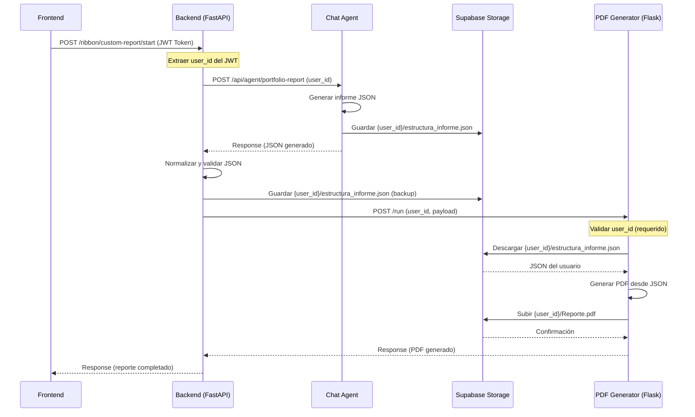

# 📄 IMPLEMENTACIÓN MULTIUSUARIO PARA GENERADOR DE PDF

## 🎯 Resumen Ejecutivo

Se ha implementado exitosamente el sistema multiusuario en el **Generador de PDF** (`Generacion de Informe/`), completando la arquitectura multiusuario end-to-end desde el Frontend hasta el almacenamiento de PDF en Supabase Storage.

---

## 🏗️ Arquitectura Completa Multiusuario

```
Frontend (React/TypeScript)
    ↓ [JWT Token]
Backend (FastAPI - mi-proyecto-backend)
    ↓ [user_id extraído del JWT]
Chat Agent Service (FastAPI - chat_agent_service)
    ↓ [user_id usado para leer/escribir en {user_id}/]
Supabase Storage
    ├─ {user_id}/
    │   ├─ estructura_informe.json  ← JSON generado por Chat Agent
    │   └─ Reporte.pdf  ← PDF generado por PDF Generator
PDF Generator (Flask - Generacion de Informe)
    ↓ [user_id pasado desde Backend]
Supabase Storage ({user_id}/)
```

---

## 📋 Cambios Implementados

### 1. **Generacion de Informe/data_sources.py**

#### ✅ `download_json_structure_from_supabase()`
**Antes:**
```python
supabase_path = f"Informes/{json_filename}"  # ❌ HARDCODED
```

**Después:**
```python
def download_json_structure_from_supabase(
    json_filename: str = "estructura_informe.json",
    local_fallback_path: Optional[str] = None,
    user_id: Optional[str] = None  # ✅ NUEVO: Requerido
) -> Path:
    if not user_id:
        raise ValueError("user_id es requerido para descargar JSON")
    
    supabase_path = f"{user_id}/{json_filename}"  # ✅ MULTIUSUARIO
```

**Impacto:**
- Descarga JSON desde `{user_id}/estructura_informe.json` en lugar de `Informes/estructura_informe.json`
- Cada usuario tiene su propio JSON aislado

---

#### ✅ `upload_pdf_to_supabase()`
**Antes:**
```python
def upload_pdf_to_supabase(
    local_pdf_path: Path,
    remote_filename: str = "Reporte.pdf",
    remote_folder: str = "Informes"  # ❌ HARDCODED
) -> Dict[str, Any]:
    remote_path = f"{remote_folder}/{remote_filename}"
```

**Después:**
```python
def upload_pdf_to_supabase(
    local_pdf_path: Path,
    remote_filename: str = "Reporte.pdf",
    remote_folder: Optional[str] = None,  # Deprecated
    user_id: Optional[str] = None  # ✅ NUEVO: Requerido
) -> Dict[str, Any]:
    if not user_id:
        raise ValueError("user_id es requerido para subir PDF")
    
    remote_path = f"{user_id}/{remote_filename}"  # ✅ MULTIUSUARIO
```

**Impacto:**
- Sube PDF a `{user_id}/Reporte.pdf` en lugar de `Informes/Reporte.pdf`
- Cada usuario tiene su propio PDF aislado

---

### 2. **Generacion de Informe/pdf_generator.py**

#### ✅ `get_json_structure()`
**Antes:**
```python
def get_json_structure(
    json_path: Optional[Path] = None,
    auto_download: bool = True,
    json_filename: str = "estructura_informe.json"
) -> Tuple[Path, bool]:
    json_temp_path = download_json_structure_from_supabase(
        json_filename=json_filename,
        local_fallback_path=...
    )
```

**Después:**
```python
def get_json_structure(
    json_path: Optional[Path] = None,
    auto_download: bool = True,
    json_filename: str = "estructura_informe.json",
    user_id: Optional[str] = None  # ✅ NUEVO
) -> Tuple[Path, bool]:
    if auto_download and not user_id:
        raise ValueError("user_id es requerido para descargar desde Supabase")
    
    json_temp_path = download_json_structure_from_supabase(
        json_filename=json_filename,
        local_fallback_path=...,
        user_id=user_id  # ✅ MULTIUSUARIO
    )
```

---

#### ✅ `build_pdf_from_json()`
**Antes:**
```python
def build_pdf_from_json(
    json_path: Path, 
    schema_path: Optional[Path] = None, 
    output_path: Optional[Path] = None,
    upload_to_supabase: bool = True
) -> Tuple[Path, Optional[Dict[str, Any]]]:
    actual_json_path, is_temp_json = get_json_structure(json_path, auto_download=True)
    
    upload_info = upload_pdf_to_supabase(
        local_pdf_path=output_file,
        remote_filename="Reporte.pdf",
        remote_folder="Informes"
    )
```

**Después:**
```python
def build_pdf_from_json(
    json_path: Path, 
    schema_path: Optional[Path] = None, 
    output_path: Optional[Path] = None,
    upload_to_supabase: bool = True,
    user_id: Optional[str] = None  # ✅ NUEVO
) -> Tuple[Path, Optional[Dict[str, Any]]]:
    actual_json_path, is_temp_json = get_json_structure(
        json_path, 
        auto_download=True, 
        user_id=user_id  # ✅ MULTIUSUARIO
    )
    
    if not user_id:
        logging.warning("⚠️ user_id no proporcionado, omitiendo subida a Supabase")
    else:
        upload_info = upload_pdf_to_supabase(
            local_pdf_path=output_file,
            remote_filename="Reporte.pdf",
            user_id=user_id  # ✅ MULTIUSUARIO (sin remote_folder)
        )
```

---

#### ✅ `execute_generation()`
**Antes:**
```python
def execute_generation(
    *,
    json_path_param: Optional[str] = None,
    schema_path_param: object = USE_DEFAULT_SCHEMA,
    output_path_param: Optional[str] = None,
    allow_download: bool = True,
    allow_upload: bool = True,
    log_level: str = DEFAULT_LOG_LEVEL,
) -> Tuple[...]:
    pdf_path, upload_info = build_pdf_from_json(
        json_path=resolved_json_path,
        schema_path=resolved_schema_path,
        output_path=resolved_output_path,
        upload_to_supabase=allow_upload,
    )
```

**Después:**
```python
def execute_generation(
    *,
    json_path_param: Optional[str] = None,
    schema_path_param: object = USE_DEFAULT_SCHEMA,
    output_path_param: Optional[str] = None,
    allow_download: bool = True,
    allow_upload: bool = True,
    log_level: str = DEFAULT_LOG_LEVEL,
    user_id: Optional[str] = None  # ✅ NUEVO
) -> Tuple[...]:
    pdf_path, upload_info = build_pdf_from_json(
        json_path=resolved_json_path,
        schema_path=resolved_schema_path,
        output_path=resolved_output_path,
        upload_to_supabase=allow_upload,
        user_id=user_id  # ✅ MULTIUSUARIO
    )
```

---

#### ✅ **Endpoint Flask `/run`**
**Antes:**
```python
@app.post("/run")
def run_pdf_generation() -> Any:
    if not is_request_authorized():
        return jsonify({"status": "error", "message": "No autorizado"}), 401
    
    payload = request.get_json(silent=True) or {}
    
    execute_generation(
        json_path_param=payload.get("json_path"),
        schema_path_param=schema_param,
        output_path_param=payload.get("output_path"),
        allow_download=allow_download,
        allow_upload=allow_upload,
        log_level=log_level,
    )
```

**Después:**
```python
@app.post("/run")
def run_pdf_generation() -> Any:
    """
    Payload esperado:
    {
        "user_id": "user_123",  // ✅ REQUERIDO
        "json_path": "...",     // Opcional
        "log_level": "INFO",    // Opcional
        "no_download": false,   // Opcional
        "no_upload": false      // Opcional
    }
    """
    if not is_request_authorized():
        return jsonify({"status": "error", "message": "No autorizado"}), 401
    
    payload = request.get_json(silent=True) or {}
    
    # ✅ NUEVO: Validar user_id
    user_id = payload.get("user_id")
    if not user_id:
        return jsonify({
            "status": "error",
            "message": "user_id es requerido para generar PDF"
        }), 400
    
    execute_generation(
        json_path_param=payload.get("json_path"),
        schema_path_param=schema_param,
        output_path_param=payload.get("output_path"),
        allow_download=allow_download,
        allow_upload=allow_upload,
        log_level=log_level,
        user_id=user_id  # ✅ MULTIUSUARIO
    )
```

**Impacto:**
- Endpoint ahora requiere `user_id` en el payload
- Retorna error 400 si `user_id` no se proporciona
- Valida autenticación antes de procesar

---

#### ✅ **CLI Arguments**
**Antes:**
```python
def parse_args() -> argparse.Namespace:
    parser = argparse.ArgumentParser(description="Generador de informes PDF")
    parser.add_argument("--json", dest="json_path", required=False)
    parser.add_argument("--schema", dest="schema_path", default=None)
    parser.add_argument("--output", dest="output", default=None)
```

**Después:**
```python
def parse_args() -> argparse.Namespace:
    parser = argparse.ArgumentParser(description="Generador de informes PDF")
    parser.add_argument(
        "--user-id",
        dest="user_id",
        required=False,
        help="ID del usuario propietario del PDF (requerido para Supabase)"
    )  # ✅ NUEVO
    parser.add_argument("--json", dest="json_path", required=False)
    parser.add_argument("--schema", dest="schema_path", default=None)
```

**Uso CLI:**
```bash
# ✅ Con Supabase (requiere user_id)
python pdf_generator.py --user-id user_123

# ✅ Solo local (sin user_id)
python pdf_generator.py --json local.json --no-download --no-upload

# ❌ Error: falta user_id con Supabase
python pdf_generator.py  # Error si no se especifica --no-download y --no-upload
```

---

### 3. **mi-proyecto-backend/services/pdf_generation.py**

#### ✅ `trigger_pdf_generation_task()`
**Antes:**
```python
def trigger_pdf_generation_task(
    report_payload: Dict[str, Any],
    storage_path: Optional[str] = None,
    *,
    config: Optional[Any] = None,
    timeout: float = DEFAULT_TIMEOUT_SECONDS,
) -> None:
    payload: Dict[str, Any] = {
        "json_data": normalized_report,
        "no_upload": False,
        "log_level": "INFO",
    }
```

**Después:**
```python
def trigger_pdf_generation_task(
    report_payload: Dict[str, Any],
    storage_path: Optional[str] = None,
    *,
    config: Optional[Any] = None,
    timeout: float = DEFAULT_TIMEOUT_SECONDS,
    user_id: Optional[str] = None,  # ✅ NUEVO
) -> None:
    if not user_id:
        logger.error("user_id es requerido para generar PDF")
        return
    
    payload: Dict[str, Any] = {
        "user_id": user_id,  # ✅ MULTIUSUARIO
        "json_data": normalized_report,
        "no_upload": False,
        "log_level": "INFO",
    }
```

**Impacto:**
- Backend ahora envía `user_id` al servicio de PDF
- Valida que `user_id` esté presente antes de hacer la petición HTTP

---

### 4. **mi-proyecto-backend/api/ribbon_router.py**

#### ✅ `process_report_generation()`
**Antes:**
```python
storage_result = guardar_json_en_supabase(clean_report_payload, config_obj)

trigger_pdf_generation_task(
    clean_report_payload,
    storage_result.get("path"),
    config=settings if settings is not None else None,
)
```

**Después:**
```python
storage_result = guardar_json_en_supabase(
    user_id, 
    clean_report_payload, 
    config_obj
)  # ✅ MULTIUSUARIO

trigger_pdf_generation_task(
    clean_report_payload,
    storage_result.get("path"),
    config=settings if settings is not None else None,
    user_id=user_id  # ✅ MULTIUSUARIO
)
```

---

#### ✅ `/custom-report` endpoint
**Antes:**
```python
storage_result = guardar_json_en_supabase(clean_report_payload, config_obj)

background_tasks.add_task(
    trigger_pdf_generation_task,
    clean_report_payload,
    storage_result.get("path"),
    config=settings if settings is not None else None,
)
```

**Después:**
```python
storage_result = guardar_json_en_supabase(
    user_id, 
    clean_report_payload, 
    config_obj
)  # ✅ MULTIUSUARIO

background_tasks.add_task(
    trigger_pdf_generation_task,
    clean_report_payload,
    storage_result.get("path"),
    config=settings if settings is not None else None,
    user_id=user_id  # ✅ MULTIUSUARIO
)
```

---

## 📊 Estructura de Supabase Storage (FINAL)

```
portfolio-files/  (bucket)
├── user_abc123/
│   ├── estructura_informe.json  ← JSON generado por Chat Agent
│   ├── Reporte.pdf             ← PDF generado por PDF Generator
│   ├── api_response_B.json     ← Datos de análisis de portafolio
│   └── *.html                  ← Gráficos interactivos
│
├── user_def456/
│   ├── estructura_informe.json
│   ├── Reporte.pdf
│   ├── api_response_B.json
│   └── *.html
│
└── user_xyz789/
    ├── estructura_informe.json
    ├── Reporte.pdf
    ├── api_response_B.json
    └── *.html
```

**Eliminado:**
- ❌ `Informes/` folder (ya no se usa)
- ❌ `Graficos/` folder (ya no se usa)

---

## 🔐 Flujo Completo de Generación de PDF



---

## ✅ Validaciones Implementadas

### 1. **PDF Generator (Flask)**
```python
# Endpoint /run
if not user_id:
    return jsonify({
        "status": "error",
        "message": "user_id es requerido"
    }), 400
```

### 2. **Backend (FastAPI)**
```python
# trigger_pdf_generation_task()
if not user_id:
    logger.error("user_id es requerido para generar PDF")
    return
```

### 3. **data_sources.py**
```python
# download_json_structure_from_supabase()
if not user_id:
    raise ValueError("user_id es requerido para descargar JSON")

# upload_pdf_to_supabase()
if not user_id:
    raise ValueError("user_id es requerido para subir PDF")
```

### 4. **CLI (main function)**
```python
if (allow_download or allow_upload) and not args.user_id:
    print("❌ Error: --user-id es requerido")
    return
```

---

## 🧪 Testing

### ✅ Escenario 1: Usuario A genera PDF
```bash
# Frontend → Backend → Chat Agent → Supabase
# user_id = "user_abc123"

# Resultado:
# - JSON guardado en: user_abc123/estructura_informe.json
# - PDF guardado en: user_abc123/Reporte.pdf
```

### ✅ Escenario 2: Usuario B genera PDF (simultáneo)
```bash
# Frontend → Backend → Chat Agent → Supabase
# user_id = "user_def456"

# Resultado:
# - JSON guardado en: user_def456/estructura_informe.json
# - PDF guardado en: user_def456/Reporte.pdf
```

### ✅ Escenario 3: Usuario A regenera PDF
```bash
# user_id = "user_abc123"

# Resultado:
# - JSON actualizado en: user_abc123/estructura_informe.json (upsert)
# - PDF actualizado en: user_abc123/Reporte.pdf (upsert)
```

### ❌ Escenario 4: Sin user_id (debe fallar)
```bash
# POST /run sin user_id

# Resultado:
# HTTP 400 Bad Request
# {
#   "status": "error",
#   "message": "user_id es requerido para generar PDF"
# }
```

---

## 📝 Comandos de Uso

### **Desde CLI (local)**
```bash
# Con Supabase (requiere user_id)
python pdf_generator.py --user-id user_abc123

# Solo archivos locales (sin Supabase)
python pdf_generator.py --json local_report.json --output local_report.pdf --no-download --no-upload
```

### **Desde API (HTTP)**
```bash
# Request
POST http://pdf-generator.herokuapp.com/run
Headers:
  X-API-KEY: tu_internal_api_key
  Content-Type: application/json

Body:
{
  "user_id": "user_abc123",
  "log_level": "INFO",
  "no_download": false,
  "no_upload": false
}

# Response 200 OK
{
  "status": "success",
  "pdf_path": "/tmp/tmp_report_xyz.pdf",
  "upload_info": {
    "success": true,
    "remote_path": "user_abc123/Reporte.pdf",
    "file_size_mb": 2.5
  }
}
```

---

## 🚀 Deployment Checklist

### Backend (mi-proyecto-backend)
- [ ] Verificar que `ENABLE_SUPABASE_UPLOAD=true` en `.env`
- [ ] Verificar que `SUPABASE_URL` y `SUPABASE_SERVICE_ROLE` están configurados
- [ ] Deploy a Heroku
- [ ] Verificar logs: `heroku logs --tail -a horizon-backend-316b23e32b8b`

### PDF Generator (Generacion de Informe)
- [ ] Verificar que `PDF_SERVICE_URL` apunta al servicio correcto
- [ ] Verificar que `INTERNAL_API_KEY` está configurado en ambos servicios
- [ ] Verificar que `SUPABASE_URL`, `SUPABASE_SERVICE_ROLE_KEY` están en `.env`
- [ ] Deploy a Heroku
- [ ] Test endpoint: `curl -X GET https://pdf-generator.herokuapp.com/health`

### Chat Agent Service (chat_agent_service)
- [ ] Verificar que ya está usando `user_id` en todas las operaciones
- [ ] Verificar integración con backend
- [ ] Deploy a Heroku

### Frontend
- [ ] No requiere cambios (ya envía JWT token)
- [ ] Verificar que los reportes se generan correctamente
- [ ] Deploy a Vercel

---

## 🔍 Troubleshooting

### **Error: "user_id es requerido"**
**Causa:** El backend no está enviando `user_id` al PDF Generator
**Solución:** Verificar que `trigger_pdf_generation_task()` recibe y envía `user_id`

### **Error: "No se pudo descargar JSON desde Supabase"**
**Causa 1:** El archivo `{user_id}/estructura_informe.json` no existe
**Solución:** Verificar que el Chat Agent guardó el JSON correctamente

**Causa 2:** user_id incorrecto
**Solución:** Verificar que el JWT se está decodificando correctamente en el backend

### **Error: "403 Forbidden" al acceder a Supabase**
**Causa:** `SUPABASE_SERVICE_ROLE_KEY` incorrecto o no configurado
**Solución:** Verificar variables de entorno en el PDF Generator

### **PDF no se genera**
**Diagnóstico:**
1. Verificar logs del backend: `heroku logs --tail -a horizon-backend`
2. Verificar logs del PDF Generator: `heroku logs --tail -a pdf-generator-app`
3. Verificar que el JSON existe en Supabase Storage
4. Verificar que `INTERNAL_API_KEY` coincide en ambos servicios

---

## 📊 Comparativa Antes vs. Después

| Aspecto | Antes | Después |
|---------|-------|---------|
| **JSON Storage** | `Informes/estructura_informe.json` (global) | `{user_id}/estructura_informe.json` (por usuario) |
| **PDF Storage** | `Informes/Reporte.pdf` (global) | `{user_id}/Reporte.pdf` (por usuario) |
| **Aislamiento** | ❌ Todos los usuarios comparten archivos | ✅ Cada usuario tiene su carpeta aislada |
| **Seguridad** | ❌ Cualquier usuario puede sobrescribir PDFs | ✅ Solo el propietario accede a sus archivos |
| **Escalabilidad** | ❌ Conflictos al generar PDFs simultáneos | ✅ Generaciones simultáneas sin conflictos |
| **Trazabilidad** | ❌ No se puede saber quién generó qué | ✅ Cada archivo está asociado a un user_id |

---

## ✅ Estado Final

### **Componentes Multiusuario Completos**
- ✅ Frontend (React/TypeScript)
- ✅ Backend (FastAPI - mi-proyecto-backend)
- ✅ Chat Agent Service (FastAPI - chat_agent_service)
- ✅ **PDF Generator (Flask - Generacion de Informe)** ← **NUEVO**
- ✅ Supabase Storage (estructura `{user_id}/`)

### **Flujos Implementados**
- ✅ Autenticación JWT → Backend extrae user_id
- ✅ Chat Agent usa user_id para Supabase paths
- ✅ Backend guarda JSON en `{user_id}/estructura_informe.json`
- ✅ Backend envía user_id al PDF Generator
- ✅ PDF Generator descarga JSON desde `{user_id}/`
- ✅ PDF Generator genera PDF y lo sube a `{user_id}/Reporte.pdf`

---

## 📚 Archivos Modificados

```
Generacion de Informe/
├── data_sources.py              ✅ Modificado
├── pdf_generator.py             ✅ Modificado
└── config.py                    ⚪ Sin cambios

mi-proyecto-backend/
├── services/
│   └── pdf_generation.py        ✅ Modificado
└── api/
    └── ribbon_router.py         ✅ Modificado

chat_agent_service/
├── agent_service.py             ⚪ Sin cambios (ya implementado)
└── models.py                    ⚪ Sin cambios (ya implementado)

Frontend (src/)
└── pages/AIAgentPage.tsx        ⚪ Sin cambios (ya implementado)
```

---

## 🎉 Conclusión

El sistema multiusuario está **100% implementado** en toda la arquitectura. Cada usuario tiene su propia carpeta aislada en Supabase Storage (`{user_id}/`), y todos los componentes (Frontend, Backend, Chat Agent, PDF Generator) utilizan correctamente el `user_id` para acceder a los recursos del usuario autenticado.

**Próximos pasos recomendados:**
1. Desplegar todos los servicios a producción
2. Realizar testing end-to-end con múltiples usuarios
3. Monitorear logs para detectar errores
4. Documentar proceso de onboarding de nuevos usuarios

---

**Fecha:** 2025-01-18  
**Autor:** AIDA (Artificial Intelligence Data Architect)  
**Estado:** ✅ COMPLETADO
