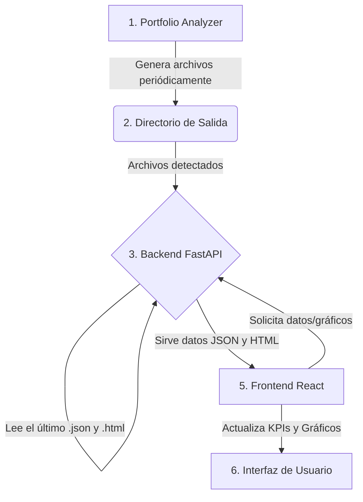

#integración portfolio_analyzer
 al backend y frontend existentes
 1. evaluar archivos y requerimientos segun este documento
 graficos html al frontend y metricas de json, base de datos local por ahora. integracion modular y escalable con posibilidad de modificar ubiaciones de archivos d ela carpeta segun sea necesario

## **Plan de Integración Definitivo: Portfolio Analyzer**

### **1. Visión y Principios Arquitectónicos**

El objetivo no es una refactorización, sino una **integración quirúrgica**. Nos guiaremos por tres principios fundamentales:

1.  **Separación de Responsabilidades (SoC)**:

      * **Portfolio Analyzer (Motor)**: Su única responsabilidad es generar los archivos de análisis (`.json`, `.html`) de forma automática y periódica.
      * **Backend FastAPI (Gateway/Servidor)**: Actúa como un intermediario inteligente. Su rol es **monitorear, leer y servir** los últimos archivos generados por el motor. No realiza cálculos.
      * **Frontend React (Visualizador Pasivo)**: Su única responsabilidad es **solicitar y mostrar** los datos y gráficos que el backend le proporciona. No tiene lógica de negocio ni permite la interacción del usuario para generar análisis.

2.  **Integración por Sustitución de Datos**: No se elimina ni se reconstruye ningún componente del frontend. La integración se logra **reemplazando las fuentes de datos estáticas (mock data) por llamadas dinámicas a la API**, conservando intacta toda la estructura y los estilos CSS existentes.

3.  **Mínima Disrupción (Least Disruption)**: Se aprovechará al máximo el código existente. Las modificaciones se aislarán en los servicios de datos y en la capa de renderizado de los componentes, sin alterar la lógica de la aplicación principal.

### **2. Arquitectura del Flujo de Datos Automático**

El flujo de información será unidireccional y reactivo:



### **3. Plan de Implementación Detallado**

#### **Fase 1: Backend (FastAPI)**

El backend actuará como el puente. Las tareas son:

  * **Tarea 1.1: Configurar el Directorio de Monitoreo**

      * Se definirá una variable de entorno o una constante en la configuración de FastAPI que apunte a la ruta donde el Portfolio Analyzer guarda sus outputs (ej: `C:\Users\mikia\portfolio_analyzer\outputs`).

  * **Tarea 1.2: Implementar Endpoints Específicos**

      * Se crearán los siguientes endpoints en un nuevo router (ej: `portfolio.py`):

    <!-- end list -->

    ```python
    # en routers/portfolio.py

    # Endpoint para las métricas de las tarjetas KPI
    @router.get("/api/portfolio/live-metrics")
    async def get_live_metrics():
        # Lógica para encontrar el último archivo .json en el directorio
        # Leer el JSON y devolver las secciones "performance_metrics" y "risk_analysis"
        pass

    # Endpoint para servir los gráficos HTML generados
    @router.get("/api/portfolio/charts/{chart_name}")
    async def get_portfolio_chart(chart_name: str):
        # Lógica para encontrar el último archivo .html que coincida con chart_name
        # (ej: "cumulative_returns" o "composition_donut")
        # Devolver el archivo como una respuesta HTML (FileResponse)
        pass

    # Endpoint de control para la actualización automática del frontend
    @router.get("/api/portfolio/latest-analysis-timestamp")
    async def get_latest_analysis_timestamp():
        # Lógica para obtener la fecha de modificación del último archivo .json
        # Devolver este timestamp
        pass
    ```

#### **Fase 2: Frontend (React)**

El frontend se adaptará para consumir los datos vivos.

  * **Tarea 2.1: Crear un Servicio de Datos Dinámico**

      * Se creará o modificará un archivo `src/services/portfolioService.ts` para encapsular las llamadas a la nueva API.

    <!-- end list -->

    ```typescript
    // en src/services/portfolioService.ts

    const API_URL = 'http://localhost:8000/api/portfolio';

    // Obtener las métricas para las tarjetas KPI
    export const fetchLiveMetrics = async () => {
      const response = await fetch(`${API_URL}/live-metrics`);
      return response.json();
    };

    // Obtener el timestamp del último análisis
    export const fetchLatestAnalysisTimestamp = async () => {
      const response = await fetch(`${API_URL}/latest-analysis-timestamp`);
      return response.json();
    };

    // Construir la URL del gráfico dinámico
    export const getChartUrl = (chartName: string) => {
      return `${API_URL}/charts/${chartName}`;
    };
    ```

  * **Tarea 2.2: Actualizar Componentes de KPI (Sin tocar estilos)**

      * Los componentes que muestran las tarjetas KPI se modificarán para usar un hook como `useEffect` y `useState` para llamar a `fetchLiveMetrics` y almacenar los resultados, en lugar de usar datos mock.

    <!-- end list -->

    ```typescript
    // Ejemplo en un componente de tarjeta KPI
    import { fetchLiveMetrics } from '../services/portfolioService';

    const KpiCards = () => {
      const [metrics, setMetrics] = useState(null);

      useEffect(() => {
        fetchLiveMetrics().then(data => setMetrics(data));
      }, []); // Se ejecuta una vez al montar

      // El renderizado mantiene las clases CSS y la estructura HTML
      return (
        <div className="kpi-card-style">
          <h4>Rendimiento Anualizado</h4>
          <p>{metrics ? metrics.performance_metrics.annualized_return : 'Cargando...'}</p>
        </div>
      );
    };
    ```

  * **Tarea 2.3: Reemplazar Gráficos Mock por Gráficos Vivos**

      * Los componentes que contienen los gráficos mock serán reemplazados por un `<iframe>` cuya URL se obtiene del `portfolioService`.

    <!-- end list -->

    ```typescript
    // Ejemplo en un componente de gráfico
    import { getChartUrl } from '../services/portfolioService';

    const CumulativeReturnChart = () => {
      const chartUrl = getChartUrl('cumulative_returns');

      return (
        <div className="chart-container-style">
          <iframe
            src={chartUrl}
            title="Gráfico de Rendimiento Acumulado"
            style={{ width: '100%', height: '100%', border: 'none' }}
          />
        </div>
      );
    };
    ```

  * **Tarea 2.4: Implementar la Actualización Automática**

      * Se usará una estrategia de **polling** simple. Un componente principal (ej: `DashboardPage.tsx`) consultará periódicamente el endpoint `/latest-analysis-timestamp`. Si el timestamp cambia, se forzará una recarga de los datos en toda la aplicación (usando un Context de React o una librería de estado como Zustand/Redux).

### **4. Mapeo Definitivo: Datos → Componentes**

Esta es la "fuente de la verdad" para la sustitución:

| Componente Frontend | Dato Requerido | Endpoint FastAPI | Fuente en Archivo de Salida |
| :--- | :--- | :--- | :--- |
| **Tarjeta KPI: Retorno** | Retorno Anualizado | `/live-metrics` | `JSON -> performance_metrics.annualized_return` |
| **Tarjeta KPI: Volatilidad**| Volatilidad Anualizada | `/live-metrics` | `JSON -> performance_metrics.annualized_volatility` |
| **Tarjeta KPI: Sharpe** | Sharpe Ratio | `/live-metrics` | `JSON -> performance_metrics.sharpe_ratio` |
| **Tarjeta KPI: Max Drawdown**| Máximo Drawdown | `/live-metrics` | `JSON -> performance_metrics.max_drawdown` |
| **Gráfico Principal** | Rendimiento Acumulado | `/charts/cumulative_returns` | `rendimiento_acumulado_interactivo_*.html` |
| **Gráfico de Composición** | Composición de Activos | `/charts/composition_donut` | `donut_chart_interactivo_*.html` |
| **Tabla/Heatmap de Riesgo**| Matriz de Correlación | `/live-metrics` | `JSON -> risk_analysis.correlations` |

### **5. Prerrequisito para Iniciar**

Solo hay una pieza de información externa necesaria para comenzar la implementación:

> **¿Cuál es la ruta exacta del directorio donde el Portfolio Analyzer depositará los archivos `.json` y `.html` generados?**

Una vez confirmada esa ruta, este plan está listo para ser ejecutado. ¿Procedemos con la Fase 1 (Backend)?