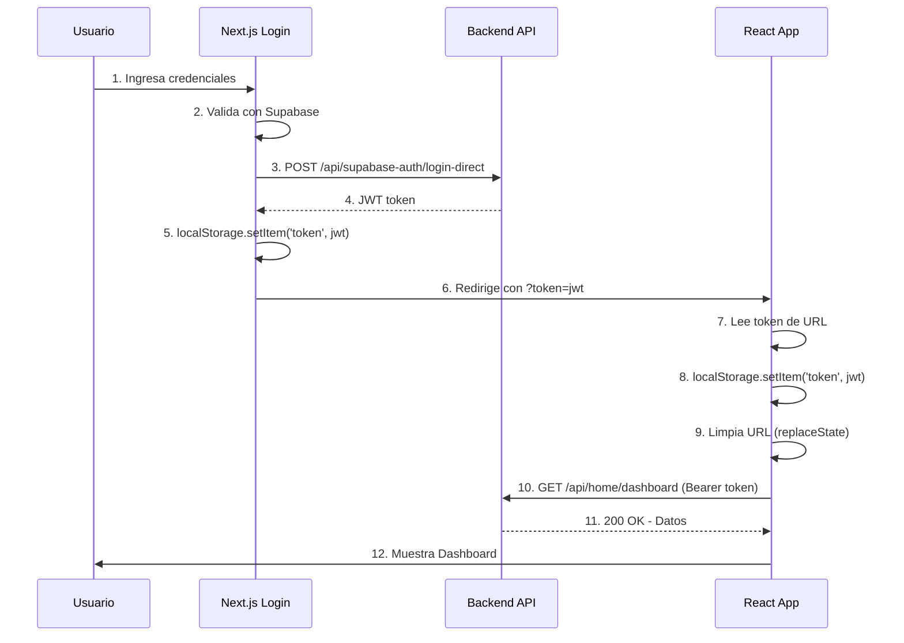

# ✅ SOLUCIÓN FINAL - Token Cross-Domain Implementada

## 🎯 Problema Resuelto

**Problema Original:**
```
Next.js (horizon-login.vercel.app) 
    ↓ guarda token en localStorage
    ↓ redirige a
React App (mi-proyecto-topaz-omega.vercel.app)
    ↓ intenta leer token
    ❌ localStorage vacío (diferentes dominios)
```

**Solución Implementada:**
```
Next.js Login
    ↓ obtiene JWT del backend
    ↓ redirige con token en URL: ?token=eyJhbGci...
React App
    ↓ lee token de URL
    ↓ guarda en localStorage
    ↓ limpia URL
    ✅ token disponible para todas las peticiones
```

---

## 🔧 Cambios Implementados

### **1. Next.js Login (horizon-next-app)**

**Archivo:** `src/app/page.tsx`

**Cambio principal:**
```typescript
// Después de obtener JWT del backend
const jwtToken = backendToken.access_token;

// Redirigir con token en URL
const webAppUrl = 'https://mi-proyecto-topaz-omega.vercel.app';
const tokenParam = `?token=${encodeURIComponent(jwtToken)}`;
window.location.href = `${webAppUrl}${tokenParam}`;
```

### **2. React App (mi-proyecto)**

**Archivo:** `src/App.tsx`

**Cambio principal:**
```typescript
// Al cargar la app, verificar si hay token en URL
const urlParams = new URLSearchParams(window.location.search);
const tokenFromUrl = urlParams.get('token');

if (tokenFromUrl) {
  // Guardar token en localStorage
  localStorage.setItem('token', tokenFromUrl);
  
  // Limpiar URL (seguridad)
  window.history.replaceState({}, document.title, window.location.pathname);
  
  setIsAuthenticated(true);
}
```

---

## 🚀 Despliegue

### **Paso 1: Desplegar Next.js**

```powershell
cd c:\Users\mikia\mi-proyecto\horizon-next-app
git add src/app/page.tsx .env.local
git commit -m "fix: implement cross-domain token passing via URL parameter"
git push origin main
```

Vercel autodesplegará. Monitorea en: https://vercel.com/dashboard

### **Paso 2: Desplegar React App**

```powershell
cd c:\Users\mikia\mi-proyecto
git add src/App.tsx
git commit -m "fix: read and store JWT token from URL parameter on app load"
git push origin main
```

Vercel autodesplegará. Monitorea en: https://vercel.com/dashboard

---

## 🧪 Test del Flujo Completo

### **Test Manual:**

1. **Limpiar caché y localStorage:**
   ```javascript
   // En consola del navegador (F12)
   localStorage.clear();
   ```

2. **Ir al login:**
   ```
   https://horizon-login.vercel.app/
   ```

3. **Ingresar credenciales** y hacer login

4. **Verificar en consola del navegador:**
   ```
   ✅ Inicio de sesión exitoso
   🔄 Intercambiando token de Supabase por JWT del backend...
   ✅ JWT del backend obtenido exitosamente
   💾 Token guardado en localStorage
   🚀 Usuario existente, redirigiendo a app web...
   ```

5. **Esperar redirección automática a:**
   ```
   https://mi-proyecto-topaz-omega.vercel.app/?token=eyJhbGci...
   ```

6. **Verificar en consola de la app React:**
   ```
   🔑 Token recibido desde URL de login
   ✅ Token guardado y URL limpiada
   ✅ Token encontrado, usuario autenticado
   ```

7. **Verificar que la URL se limpió:**
   ```
   https://mi-proyecto-topaz-omega.vercel.app/
   (sin el parámetro ?token=...)
   ```

8. **Verificar que el dashboard carga sin error 403**

### **Test con DevTools:**

```javascript
// 1. Verificar token en localStorage
localStorage.getItem('token')
// Debe retornar: "eyJhbGciOiJIUzI1NiIsInR5cCI6IkpXVCJ9..."

// 2. Verificar que el token no está en la URL
window.location.href
// Debe ser: "https://mi-proyecto-topaz-omega.vercel.app/"
// NO debe incluir: "?token=..."
```

---

## 🔒 Consideraciones de Seguridad

### **✅ Implementadas:**

1. **Token en URL solo transitorio:** El token se pasa por URL solo durante la redirección (< 1 segundo)
2. **URL limpiada inmediatamente:** Después de guardar el token, se elimina de la URL
3. **HTTPS obligatorio:** Todas las comunicaciones son cifradas
4. **Token con expiración:** JWT expira en 30 minutos

### **⚠️ Advertencias:**

1. **Historial del navegador:** El token puede quedar en el historial por un momento
   - Solución: `window.history.replaceState()` lo elimina del historial
   
2. **Logs del servidor:** La URL con token puede quedar en logs
   - Impacto: Mínimo, el token expira rápido

3. **No compartir enlaces:** Nunca compartas la URL mientras tenga `?token=`
   - Mitigación: La URL se limpia automáticamente

---

## 📊 Flujo de Autenticación Final



---

## 🐛 Troubleshooting

### **Error: "No hay token válido"**

**Causa:** El token no se pasó correctamente desde Next.js.

**Solución:**
```javascript
// En Next.js, verificar en consola:
console.log('JWT Token:', jwtToken);

// En React, verificar en consola:
console.log('Token from URL:', urlParams.get('token'));
```

### **Error: "Funcionário não encontrado"**

**Causa:** Esto era cuando redirigía sin token. Ya no debería pasar.

**Verificar:**
1. Que Next.js está desplegado con los cambios
2. Que React App está desplegado con los cambios
3. Que el token se está pasando en la URL

### **Error 403 persiste**

**Verificar:**
```javascript
// En consola de React App
const token = localStorage.getItem('token');
console.log('Token length:', token?.length);
// Debe ser > 100 caracteres

// Verificar que se envía en headers
// En Network tab → Headers
// Authorization: Bearer eyJhbGci...
```

---

## ✅ Checklist de Despliegue

- [ ] Código de Next.js actualizado en GitHub
- [ ] Código de React App actualizado en GitHub
- [ ] Next.js desplegado en Vercel
- [ ] React App desplegado en Vercel
- [ ] Test de login exitoso
- [ ] Token se pasa correctamente por URL
- [ ] Token se guarda en localStorage
- [ ] URL se limpia automáticamente
- [ ] Dashboard carga sin error 403
- [ ] Navegación funciona correctamente

---

**Fecha:** 19 de octubre de 2025
**Estado:** ✅ SOLUCIÓN COMPLETA - LISTO PARA DESPLEGAR
